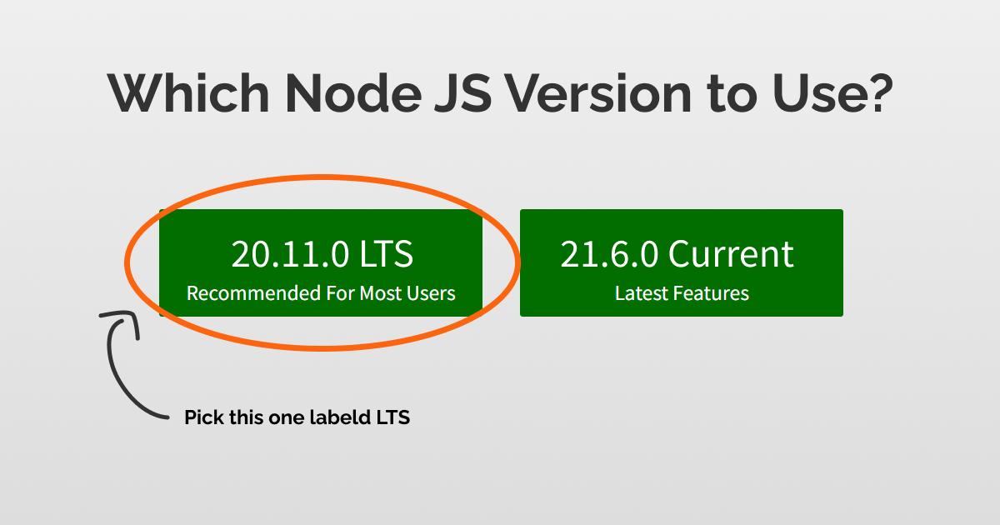

## How to Install and Configure TailwindCSS in a React Project Using Vite

<div align="center">
    
</div>

### Prerequisites
Before starting, ensure you have the following installed:
- **Node.js** (LTS version recommended)  
  <div align="center">
      
  </div>

- **npm** or **yarn**  
  <div align="center">
      
  </div>

---

### Step 1: Create a React Project Using Vite

1. **Install Vite** and create a React project:  
   <div align="center">
      
   </div>

   ```bash
   npm create vite@latest my-react-tailwind-app
   ```
   - When prompted, choose the following options:
     - Project name: `my-react-tailwind-app`
     - Framework: `React`
     - Variant: `JavaScript` (or `TypeScript` if preferred)

2. Navigate into the project folder:
   ```bash
   cd my-react-tailwind-app
   ```

3. Install dependencies:
   ```bash
   npm install
   ```

---

### Step 2: Install Tailwind CSS

<div align="center">
    
</div>

1. Install **Tailwind CSS** and its dependencies:
   ```bash
   npm install -D tailwindcss postcss autoprefixer
   ```

2. Initialize the Tailwind config file:
   ```bash
   npx tailwindcss init
   ```
   This will create a `tailwind.config.js` file in the root of your project.

---

### Step 3: Configure Tailwind CSS

1. **Configure the `tailwind.config.js` file** by updating the `content` section to include the necessary paths for your files:
   ```js
   /** @type {import('tailwindcss').Config} */
   module.exports = {
     content: [
       "./index.html",
       "./src/**/*.{js,jsx,ts,tsx}",
     ],
     theme: {
       extend: {},
     },
     plugins: [],
   };
   ```

---

### Step 4: Add Tailwind to Your CSS

1. In your `src` folder, open or create a `src/index.css` file and add the following `@tailwind` directives:
   ```css
   @tailwind base;
   @tailwind components;
   @tailwind utilities;
   ```

---

### Step 5: Import CSS in Your React Application

<div align="center">
    
</div>

1. Go to your `src/main.jsx` (or `src/main.tsx` for TypeScript) file and import the `index.css`:
   ```js
   import React from 'react'
   import ReactDOM from 'react-dom/client'
   import './index.css'
   import App from './App'

   ReactDOM.createRoot(document.getElementById('root')).render(
     <React.StrictMode>
       <App />
     </React.StrictMode>
   )
   ```

---

### Step 6: Start the Development Server

Run the development server to ensure everything works:
```bash
npm run dev
```

Now, your React app should be running with Tailwind CSS configured!

---

### Step 7: Add Some Tailwind Styles

To verify Tailwind is working, you can modify the `App.jsx` file to include some Tailwind classes. For example, change the default content to:

```jsx
function App() {
  return (
    <div className="min-h-screen flex items-center justify-center bg-gray-100">
      <h1 className="text-4xl font-bold text-blue-600">
        Hello, Tailwind with React & Vite!
      </h1>
    </div>
  )
}

export default App;
```

---

### Step 8: Build the Project for Production

Once you're ready to build your project for production, run:
```bash
npm run build
```

This will create an optimized version of your app in the `dist` folder.

<div align="center">
    
</div>

---


